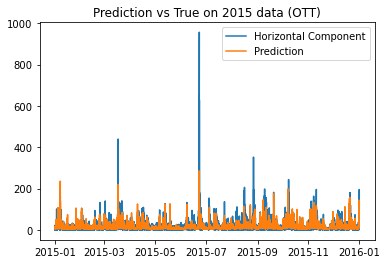

# geomag_predict

This repository implements machine learning models to predict the horizontal component of geomagnetic perturbations on various ground magnetic stations. For now, we implemented the artifical neural networks (ANN) on NEW, OTT, WNG, ABK, YKC stations, originally proposed by [1]. The data were derived from [OMNI](https://cdaweb.gsfc.nasa.gov/pub/data/omni/omni_cdaweb/) and [SuperMag](https://supermag.jhuapl.edu/) datasets. We used 2010-2014 as the training set and 2015 as the testing set.

## Instruction

1. To run the notebook the recommended Python version is 3.9 and the PyTorch version is 1.12.1. 
2. The other required Python libraries are pandas, numpy, pickle, time, datashader. 
3. Run the notebook from the beginning once the required libraries are installed locally.

## Examples

Here we included the ANN prediction result for the OTT station with 1-minute cadence. The RMSE for the model is about 14.9 nT. 

## References

[1] Amy M Keesee, Victor Pinto, Michael Coughlan, Connor Lennox, Md Shaad Mahmud, and Hyunju K Connor. Comparison of deep learning techniques to model connections between solar wind and ground magnetic perturbations. Frontiers in Astronomy and Space Sciences, 7:550874, 2020.
